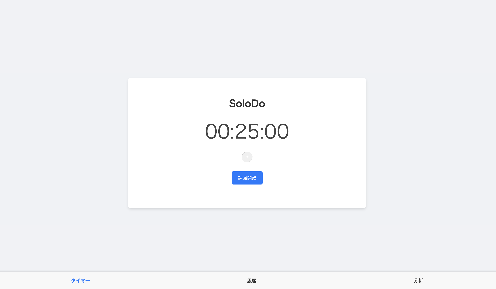

# SoloDo

ひとりに最適化されたポモドーロ・タイマー付き学習ログアプリ

## 概要

SoloDoは、ポモドーロ・テクニックに基づいたタイマーと学習ログの記録を組み合わせた、  
ひとり学習のためのシンプルな支援アプリです。

- 学習時間の記録と振り返り
- 休憩を挟みながら集中力を維持
- タグ管理で学習の傾向を可視化

## アプリURL

[https://solodo.vercel.app](https://solodo.vercel.app)

## スクリーンショット



## 主な機能

- ポモドーロ学習タイマー（25分学習 + 5分休憩）
- ログの自動保存（日時・タグ付き）
- タイマーの継続（リロード・画面遷移しても持続）
- タイマー終了時の通知音
- タグ選択による学習内容の分類

## 使用技術

- React (Vite)
- TypeScript
- localStorage / React Context
- Vercel (Hosting)

## ローカルでのセットアップ方法

```bash
git clone https://github.com/yourname/solodo.git
cd solodo
npm install
npm run dev
```

## 今後のアップデート予定

- 学習統計の可視化
- ログの編集機能
- クラウド同期

## 作者情報

- [Xアカウント](https://x.com/toshiki_sec)
